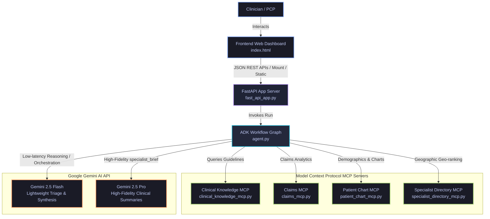
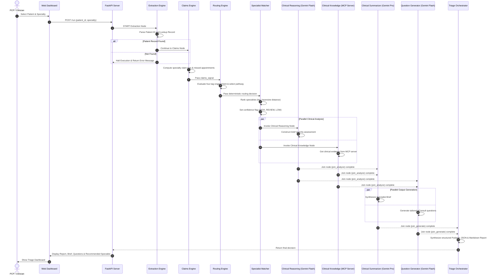

# smart-care-triage

Multi-agent Clinical Triage and Referral Routing Engine. Built on the Google Agent Development Kit (ADK 2.0) and backed by Google Gemini models, this application deterministically routes patient referrals, recommends in-network specialists, retrieves clinical guidelines, and synthesizes medical documentation.

---

##  System Architecture & Design

### System Overview Diagram
This diagram shows the relationship between the Frontend Dashboard, FastAPI application server, the Google ADK workflow engine, local Model Context Protocol (MCP) data servers, and the Gemini API layer.



### Clinical Triage Sequence Diagram
Below is the chronological sequence of events and node transitions during a single patient referral triage. It highlights the transition from deterministic parsing to parallelized clinical analysis, parallelized report generation, and final compilation.



---

## 📂 Project Structure

```
smart-care-triage/
├── app/                        # Core agent workflow code
│   ├── app_utils/              # Shared App utilities and helper typings
│   ├── agent.py                # Main workflow routing graph configuration
│   ├── claims_engine.py        # Deterministic claims analyzer node
│   ├── clinical_data.py        # Patient bundle storage and mock directory lookups
│   ├── extraction.py           # Patient ID parser and loader node
│   ├── fast_api_app.py         # FastAPI Web app server and static mounters
│   ├── hitl.py                 # Human-In-The-Loop gate plugin and logger
│   ├── observability.py        # Telemetry, token-counters, and step tracer
│   ├── routing.py              # Care-pathway selection rules node
│   ├── schemas.py              # Pydantic structured output models
│   ├── specialist_matcher.py   # Specialist geo-ranking and confidence calculator
│   ├── sub_agents.py           # Factory configurations for AI-driven nodes
│   └── tools.py                # Formatting and trend-analysis utilities
├── frontend/                   # Interactive Web interface
│   └── index.html              # Core dashboard static webpage
├── mcp_servers/                # Model Context Protocol servers (EHR bridges)
│   ├── claims_mcp.py           # FastMCP Claims data bridge
│   ├── clinical_knowledge_mcp.py # FastMCP Medical guidelines bridge
│   └── patient_chart_mcp.py    # FastMCP Patient chart data bridge
├── tests/                      # Testing registries (unit, integration, load)
├── decisions.jsonl             # Active logger recording PCP triage decisions
├── pyproject.toml              # UV python dependencies config
└── uv.lock                     # UV locked package metadata
```

---

## 🚀 Quick Start (Running Locally)

### Prerequisites
Before running, ensure your local system is equipped with:
*   **uv**: High-performance Python packaging tool ([Installation Guide](https://docs.astral.sh/uv/getting-started/installation/)).
*   **Google Cloud SDK**: Set up and authenticated with a project ID to use Gemini and Cloud Logging ([SDK Guide](https://cloud.google.com/sdk/docs/install)).
*   **Active Application Default Credentials (ADC)**: Run `gcloud auth application-default login` from your terminal so the local app can authenticate to the Gemini API.

### Setup and Install Dependencies
Run the initial setup to install `agents-cli` and package components:

```bash
# Set up Google agents CLI and base skills
uvx google-agents-cli setup

# Install required local workspace python dependencies
agents-cli install
```

### Launching the Dashboard Server
You can launch the FastAPI server locally by running:

```bash
# Run using Python uvicorn
uv run python app/fast_api_app.py
```

Once running, navigate your web browser to:
👉 **[http://localhost:8000/dashboard](http://localhost:8000/dashboard)** to interact with the clinical triage dashboard.

---

## 🛠️ CLI Commands & Utilities

| Command | Description |
| :--- | :--- |
| `agents-cli install` | Installs local Python dependencies. |
| `agents-cli playground` | Launches a local ADK CLI terminal web playground. |
| `agents-cli lint` | Runs code quality and stylistic checks. |
| `uv run pytest tests/` | Runs all unit and integration tests. |
| `agents-cli deploy` | Deploys active nodes to Google Cloud Run. |

---

*Copyright 2026 Google LLC. Licensed under the Apache License, Version 2.0.*
