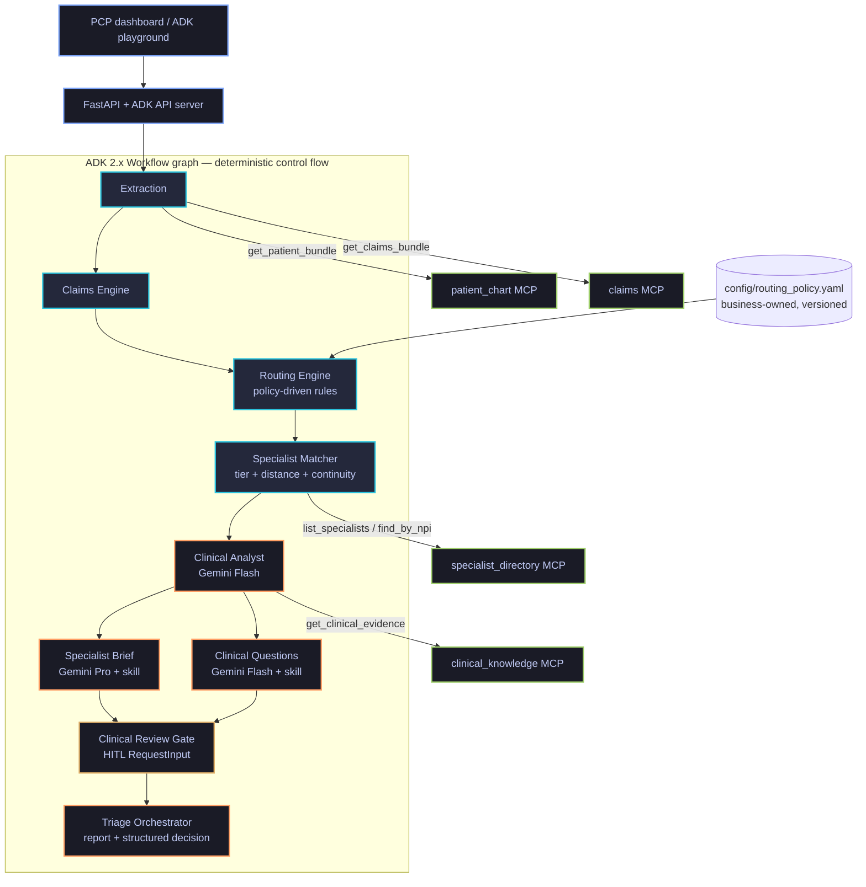
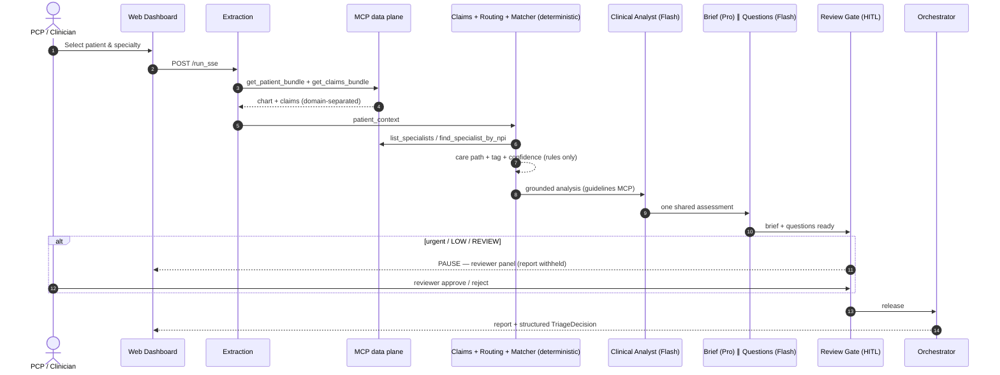
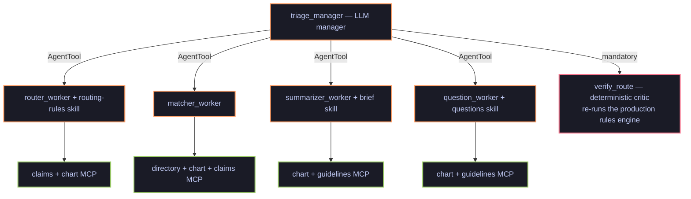

# PCP Assist — Smart Care Triage

Multi-agent clinical referral triage and routing engine, built on the **Google Agent Development Kit (ADK 2.x)** with **Gemini** models, a **Model Context Protocol (MCP)** data plane, a **business-owned routing policy**, a **server-side human-in-the-loop review gate**, and a measurable **feedback loop**.

At the moment a PCP creates a specialist referral, the system:

1. **Routes the care path deterministically** — eConsult, Virtual, or In-person — from claims, encounters, and appointments. The LLM plays **no part** in choosing the care path.
2. **Recommends the right specialist** — the patient's *existing* specialist for In-person continuity, the internal pool for Virtual, tier-then-distance ranking for eConsult.
3. **Writes a guideline-grounded Specialist Brief** (Gemini 2.5 Pro) from the full 24-month longitudinal record.
4. **Drafts 2–3 patient-specific clinical questions** anchored to guideline decision points — never "evaluate and treat".
5. **Holds urgent / low-confidence referrals at a review gate** until a clinical reviewer releases them.
6. **Logs every decision** (stamped with the policy version) and joins it to the PCP's accept/override — so agent improvement is measurable over time.

---

## Architecture

### Production app (`app/`) — deterministic workflow + MCP data plane



Key properties:

- **Deterministic decision plane.** Care path, patient tag, specialist ranking, and confidence are pure code, driven by [`config/routing_policy.yaml`](config/routing_policy.yaml) (specialty→path map, claim look-back window, tag taxonomy, tier thresholds). Every decision is stamped with `policy_version` for auditability.
- **MCP data plane.** The deterministic nodes act as MCP *clients* of four servers (chart, claims/data-lake, specialist directory, clinical guidelines). Servers serve local synthetic data by default and the same tool contracts against **BigQuery** with `USE_BIGQUERY=1` — agents never change when the backend does.
- **Three LLM agents, one shared analysis.** The Clinical Analyst produces a single guideline-grounded assessment that both the Brief and the Questions consume — they always tell the same clinical story.
- **A review gate that actually gates.** Urgent / LOW / REVIEW referrals pause on an ADK `RequestInput` interrupt *before* the report is released; the dashboard shows a reviewer panel (approve/reject), and `/pcp_action` refuses sign-off server-side without reviewer approval.

### Triage sequence



### Comparison app (`app_llm/`) — LLM manager/worker + deterministic critic



The LLM proposes the route; the **deterministic critic verifies it** against the production rules engine. On mismatch the router gets one correction loop with the verifier's evidence; if it still disagrees, the deterministic result overrides (and says so). See [`app_llm/README.md`](app_llm/README.md) for the tradeoff table.

---

## Repository layout

| Path | What it is |
|---|---|
| `app/` | Production agent: workflow graph, deterministic engines, LLM sub-agents, HITL gate, FastAPI server |
| `app_llm/` | LLM manager/worker comparison architecture with deterministic critic |
| `mcp_servers/` | Four FastMCP stdio servers (chart, claims, specialist directory, clinical knowledge) — local data or BigQuery |
| `config/routing_policy.yaml` | Business-owned routing policy (versioned; stamped into every decision) |
| `data/` | Synthetic dataset: 111 patient bundles, 99-specialist directory, golden answer key |
| `frontend/` | EMR-style dashboard (`index.html`) + learning-loop page (`insights.html`) |
| `tests/` | Spec-derived routing validator, unit truth-table tests, eval harness + configs |
| `deployment/` | Terraform for optional single-project infra (Agent Runtime target) |

---

## Run locally

Prereqs: Python 3.11–3.13, [uv](https://docs.astral.sh/uv/), a GCP project with Vertex AI enabled, and `gcloud auth application-default login` (the LLM agents call Gemini via Vertex).

```bash
git clone https://github.com/GaneshkrishnaL/multi-agent-referral-routing-poc.git
cd multi-agent-referral-routing-poc
uv sync

# 1. Verify the deterministic core (no LLM, no cloud needed)
uv run python tests/validate_routing.py     # spec cross-check + golden + invariants
uv run pytest tests/unit -q                 # routing truth-table tests

# 2. Start the server
uv run python app/fast_api_app.py
```

Then open:

| URL | What |
|---|---|
| http://localhost:8000/dashboard/ | PCP Assist dashboard (triage, HITL gate, sign-off) |
| http://localhost:8000/dev-ui/ | ADK playground — switch the app dropdown between `app` and `app_llm` |
| http://localhost:8000/dashboard/insights.html | Learning loop (acceptance per policy version) |
| http://localhost:8000/docs | REST API docs |

### Test prompts (golden cases)

```text
Triage the referral for patient 00fa1d1d-d444-7652-9b80-04c230e3df21 to Endocrinology      # eConsult + prior no-show
Triage patient 0659dab1-c5cc-5440-96cc-8bf415e01dc1 for Cardiology                          # Virtual, internal pool
Triage the referral for patient 0b24b2f7-3d97-339b-a403-a75bafee503e to Cardiology          # In-person continuity
Triage the urgent referral for patient 2057220a-4365-d8c7-d3c1-7a2b4f1f1941 to Pulmonology  # review gate pauses
Triage the referral for patient MINT-0006 to Dermatology                                    # refused (out of policy)
```

### Change the routing rules without touching code

Edit [`config/routing_policy.yaml`](config/routing_policy.yaml) (specialty lists, claim window, tier thresholds, tag strings), bump `policy_version`, restart. Re-run `tests/validate_routing.py` before adopting a new version — the answer key is derived from the routing spec independently of the code, so divergence fails loudly.

---

## Run on Google Cloud

### Option A — Cloud Run (dashboard + playground; recommended for demos)

```bash
gcloud run deploy smart-care-triage --source . \
  --project=YOUR_PROJECT --region=us-central1 \
  --no-allow-unauthenticated \
  --memory=2Gi --cpu=2 --min-instances=1 --max-instances=1 --session-affinity \
  --set-env-vars=GOOGLE_CLOUD_LOCATION=global,USE_MCP=1
```

The Dockerfile ships the app, both agent variants, the MCP servers, the synthetic data, and the policy config. For browser access keep it locked and front it with **IAP**:

```bash
gcloud run services update smart-care-triage --iap --project=YOUR_PROJECT --region=us-central1
gcloud beta iap web add-iam-policy-binding --resource-type=cloud-run \
  --service=smart-care-triage --region=us-central1 --project=YOUR_PROJECT \
  --member=user:YOU@DOMAIN.com --role=roles/iap.httpsResourceAccessor
```

Then `https://<service-url>/dashboard/` and `/dev-ui/` work directly in the browser behind Google sign-in.

### Option B — Agent Runtime (managed engine) + Gemini Enterprise registry

```bash
uv tool install google-agents-cli
agents-cli deploy --project=YOUR_PROJECT --region=us-central1 --no-confirm-project
agents-cli publish gemini-enterprise --display-name "PCP Assist" --interactive
```

Notes:
- Agent Runtime is **source-packaged**; make sure `mcp_servers/`, `data/`, and `config/` ship alongside `app/` (the default packs only the agent dir).
- Query the engine via the `vertexai` SDK (`agent_engines.get(...).stream_query(...)`).

### BigQuery data backend

Load `data/patient_bundles.json` and `data/specialists.csv` into a `smart_care_triage` dataset (`patient_bundles` with a `bundle_json` column, and `specialists` including the `Internal` column), then set `USE_BIGQUERY=1`. The MCP tool contracts are identical — only the storage behind them changes.

---

## Evaluations

Three metrics mirror the architecture (see [`tests/eval/README.md`](tests/eval/README.md)):

| Metric | Type | Grades |
|---|---|---|
| `triage_clinical_quality` | LLM judge | brief grounding, question specificity, explainability, tailoring |
| `routing_matches_policy` | deterministic | care path == spec-derived expectation |
| `review_gate_behavior` | deterministic | urgent pauses, routine releases |

```bash
uv run python tests/eval/generate_traces.py      # run the real agent over the eval cases
agents-cli eval grade --config tests/eval/eval_config.yaml
agents-cli eval compare <prev>.json <new>.json   # regression check per iteration
```

Cloud-side (managed `evaluationRun`s on the Agent Platform eval service, visible under Vertex AI → Evaluation): see the recipe in `tests/eval/README.md`.

## Feedback loop — proving the agent improves

Every machine decision is logged with `session_id` and `policy_version`; every PCP accept/override joins back to it. `GET /feedback_stats` aggregates acceptance by policy version, day, and care path — rendered at `/dashboard/insights.html`. Iterate the policy or prompts → bump `policy_version` → watch the new version's acceptance against the last, alongside offline eval scores.

---

## Safety posture

- The care-path decision is rules-only and reproducible; AI writes documentation, never the route.
- Urgent / low-confidence referrals block server-side for clinical review before anything is released.
- All data in this repository is **synthetic** (Synthea-derived, de-identified shapes). No PHI.
- MCP servers are read-only with parameterized queries; no API keys in the repo (Vertex auth via ADC).

## License

Apache-2.0
